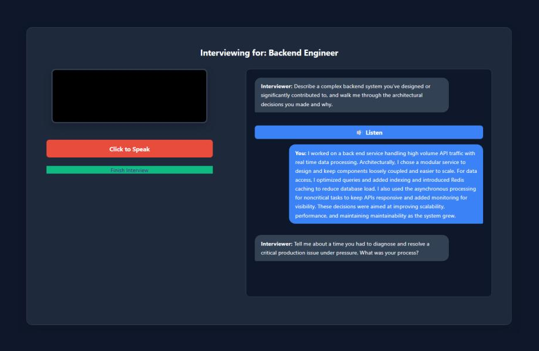
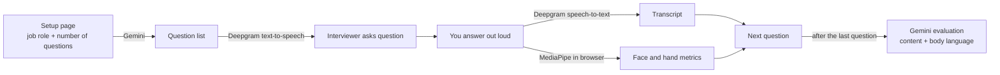
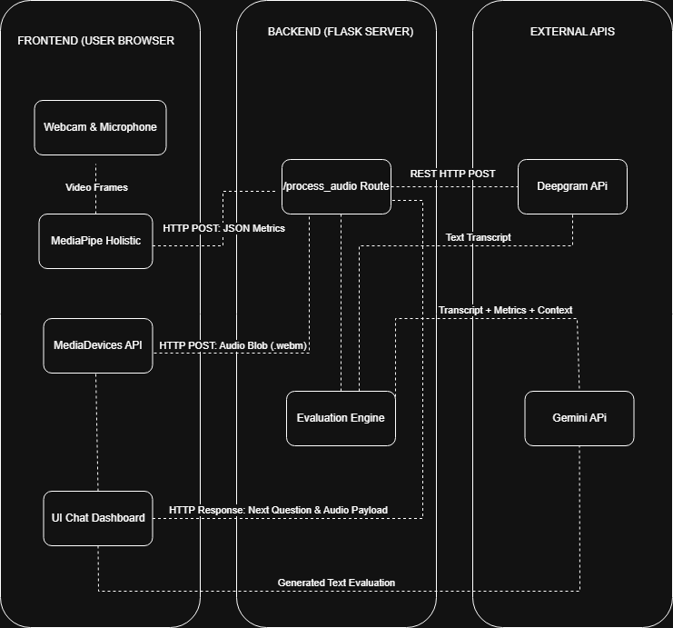

# Interview Simulator

**Practise job interviews out loud with an AI interviewer that listens to your answers, watches your body language, and tells you how you did.**

Type in the job you're going for, and the simulator builds a set of interview questions for that exact role. An AI voice reads each question aloud, you answer by speaking (just as you would in a real interview), and your webcam tracks how present and expressive you are. At the end you get a written evaluation of both what you said and how you came across.



## Why it exists

Most interview practice tools are text chatbots. Typing an answer is nothing like saying it under pressure to another person. This project recreates that pressure: you hear the question, you have to answer on the spot, and you're on camera.

## Features

- **Questions written for your role.** Enter anything from "Junior Software Engineer" to "Band 5 Dietitian for the NHS" and Google Gemini generates fresh, role-specific questions every time, so you never practise against the same static list.
- **Spoken questions and spoken answers.** Deepgram reads each question aloud in a natural voice and transcribes your spoken answer. Choose from nine voices (US, UK and Irish English) or turn the voice off.
- **Body language tracking.** Google MediaPipe runs in your browser and measures how often your face is in frame and how often you use your hands while you answer.
- **A full evaluation at the end.** Gemini reviews every question, answer and body language reading together and returns feedback on the content of your answers and on your on-camera presence.
- **Light and dark mode.**

## How it works





| Part | Technology |
|---|---|
| Web server | Python, Flask |
| Front end | HTML, CSS, vanilla JavaScript |
| Question generation and feedback | Google Gemini (`gemini-2.5-flash-lite`, `gemini-2.5-flash`) |
| Voice in and out | Deepgram (Nova-2 speech-to-text, Aura text-to-speech) |
| Body language | Google MediaPipe Holistic, running client-side |

## Getting started

### What you need

- **Python 3.9 or newer**
- **A webcam and microphone.** The camera is optional: if you decline camera access, body language simply isn't scored.
- **Google Chrome or Microsoft Edge.** Other browsers may record audio in a format the transcription step doesn't expect.
- **Two API keys**, both of which you can create yourself:
  - a **Deepgram** API key from the [Deepgram Console](https://console.deepgram.com/)
  - a **Gemini** API key from [Google AI Studio](https://aistudio.google.com/apikey)

### 1. Download the project

```bash
git clone https://github.com/Yassman04/Interview-Simulator.git
cd Interview-Simulator
```

### 2. Create a virtual environment and install dependencies

```bash
python -m venv .venv

# macOS / Linux
source .venv/bin/activate
# Windows
.venv\Scripts\activate

pip install -r requirements.txt
```

### 3. Add your API keys

Copy the example settings file:

```bash
# macOS / Linux
cp .env.example .env
# Windows
copy .env.example .env
```

Open `.env` and fill in the three values:

```ini
DEEPGRAM_API_KEY=your_deepgram_key
GEMINI_API_KEY=your_gemini_key
FLASK_SECRET_KEY=any_long_random_string
```

To generate a secret key, run:

```bash
python -c "import secrets; print(secrets.token_hex(16))"
```

`.env` is listed in `.gitignore`, so your keys are never committed.

### 4. Start the app

Run this from the project's root folder (not from inside `src`):

```bash
python src/app.py
```

Your browser opens at **http://127.0.0.1:5000**. If it doesn't, open that address yourself.

## Using the simulator

1. **Set up your interview.** Enter the job role (the more specific, the better the questions) and choose between 1 and 10 questions. Click **Start Interview**. Generating the questions takes a few seconds.
2. **Allow camera and microphone access** when your browser asks. Position yourself so your face is clearly in frame.
3. **Listen to the first question.** Click **🔊 Listen** to hear it, or read it in the chat panel.
4. **Answer out loud.** Click **Click to Speak**, give your answer, then click again to stop. The button shows **Grading Answer…** while your answer is transcribed. Your answer appears in the chat, and the interviewer asks the next question.
5. **Repeat** until the interviewer says the interview is over.
6. **Get your feedback.** Click **Finish Interview**. After a short wait you'll see an evaluation of your answers and your body language. Click **Start New Interview** to go again.

**Settings during the interview:** open **⚙️ Voice Settings** to switch the interviewer's voice or turn spoken questions off. **🌙 Dark Mode** toggles the theme.

### Tips for useful feedback

- Answer as you would in the real thing: full sentences, real examples, no reading from notes.
- Keep your face in the frame and sit where there's decent light.
- Natural hand gestures help. The evaluation treats no movement as stiff and constant movement as distracting.
- Run the same role several times. The questions change each time.

## Privacy

- **Your video never leaves your computer.** Body language tracking runs entirely in your browser. Only counts (how many frames showed your face or hands) are sent to the app.
- **Your voice and answers are sent to third-party services.** Recorded answers go to Deepgram for transcription, and your questions and transcribed answers go to Google Gemini for evaluation. Both are covered by those providers' own terms.
- Nothing is saved once you close the session, apart from a temporary audio file that is overwritten on each answer.

## Troubleshooting

| Problem | Fix |
|---|---|
| The interview always uses generic questions like "Tell me about yourself" | Gemini couldn't be reached. Check `GEMINI_API_KEY` in `.env`. |
| Your answers show as "Error transcribing audio." | Check `DEEPGRAM_API_KEY`, and that your microphone is allowed in the browser. |
| No voice plays | Check `DEEPGRAM_API_KEY`, your volume, and that **Voice is ON** in Voice Settings. |
| Body language isn't mentioned in the feedback | Camera access was declined or no webcam was found. Allow it in the browser's site settings and start a new interview. |
| `ModuleNotFoundError` | Activate your virtual environment and run `pip install -r requirements.txt` again. |

## Roadmap

- Follow-up questions based on what you just said, instead of a fixed list
- Scores for speaking pace and filler words ("um", "like")
- Downloadable feedback report
- Save past interviews to track progress over time

## Author

Built by **Yaseen Mneimneih**. [LinkedIn](https://www.linkedin.com/in/yaseen-mneimneih-8a9305233/) · [GitHub](https://github.com/Yassman04)
